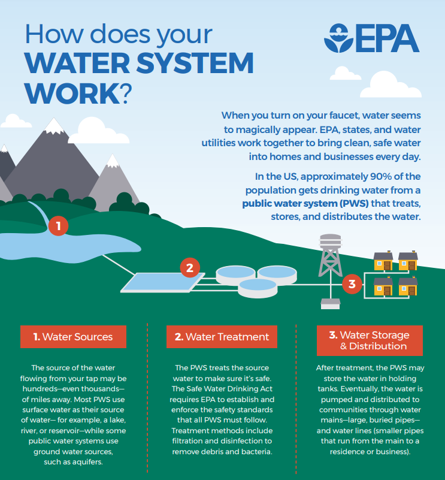

# Drinking Water

The United States enjoys one of the world's most reliable and safest supplies of drinking water. Congress passed the [Safe Drinking Water Act \(SDWA\)](https://www.epa.gov/sdwa) in 1974 to protect public health, including by regulating public water systems. 

The Safe Drinking Water Act \(SDWA\) requires EPA to [establish and enforce standards](https://www.epa.gov/ground-water-and-drinking-water/national-primary-drinking-water-regulations) that public drinking water systems must follow. EPA delegates [primary enforcement responsibility](https://www.epa.gov/dwreginfo/primacy-enforcement-responsibility-public-water-systems) \(also called primacy\) for public water systems to states and Indian Tribes if they meet certain requirements.

Approximately 150,000 [public water systems](https://www.epa.gov/dwreginfo/information-about-public-water-systems) provide drinking water to most Americans. Customers that are served by a public water system can contact their local water supplier and ask for information on contaminants in their drinking water, and are encouraged to request a copy of their [Consumer Confidence Report](https://www.epa.gov/ccr/ccr-information-consumers). This report lists the levels of contaminants that have been detected in the water, including those by EPA, and whether the system meets state and EPA drinking water standards.

About 10 percent of people in the United States rely on water from private wells. Private wells are not regulated under the SDWA.  People who use private wells need to take precautions to ensure their drinking water is safe. [Learn more about private wells](https://www.epa.gov/privatewells)

